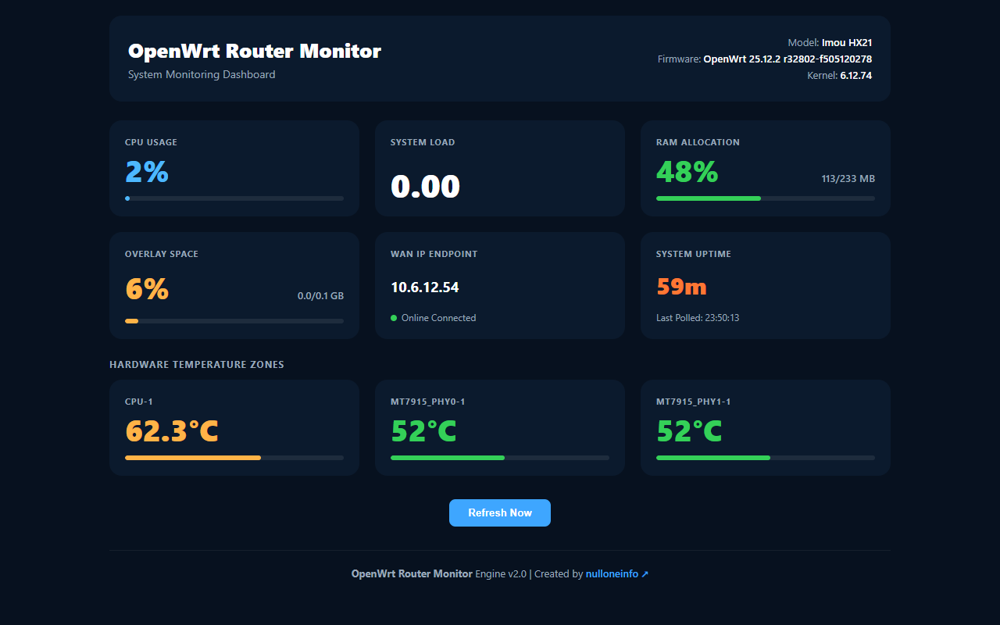

# OpenWrt Router Monitor

A lightweight real-time monitoring dashboard for OpenWrt and ImmortalWrt routers.

Displays CPU Temperature, CPU Usage, Free RAM, and System Uptime through a simple web interface built with Shell CGI and uHTTPd.

## Features

- **Generic Thermal Sensor Engine:** Dynamically tracks variable thermal registers (`temp*_input`, multi-zone mappings, system directories) across different SoC chips.
- **Portable Storage Engine:** Robust parsing mechanism compatible with varied configurations including split layouts, standard mounts, and external root targets (Extroot).
- **True Real-time System Load:** Stripped down to precise numerical reporting to preserve diagnostic context across single-core and multi-core configurations.
- **Network Pipeline Tracking:** Real-time checking of active WAN link endpoints and dynamic visibility of online state context.
- **Upgraded Responsive UI:** Rebuilt layout structures tailored to scale natively with optimized minimum bounds (280px minimum layouts) for mobile form factors.
- Auto Refresh (5 seconds) & Manual Refresh Action.
- No PHP, Python, Node.js, or Database.

## Screenshots

<table>
<tr>
<td align="center" width="100%">
<b>Desktop View</b><br><br>

</td>
</tr>
</table>

## Installation

SSH Login:

```text
Example: ssh root@router-ip | ssh root@192.168.1.1
```

```sh
wget -qO- https://raw.githubusercontent.com/nulloneinfo/openwrt-router-monitor/main/install.sh | sh

```

Open:

```text
http://ROUTER-IP/temp.html
```

Example:

```text
http://192.168.1.1/temp.html
```

## Uninstall

```sh
rm -f /www/temp.html
rm -f /www/cgi-bin/router_stats.sh
/etc/init.d/uhttpd reload
```

## Compatibility

Tested on:

- ImmortalWrt 24.x
- OpenWrt 23.x
- OpenWrt 24.x
- MT7621 Routers
- Imou HX21
- D-Link DIR-853 A3

## Resource Usage

- RAM: < 1 MB
- Storage: < 10 KB
- No background daemon
- Uses only built-in OpenWrt components

## Author

**nulloneinfo**

GitHub: https://github.com/nulloneinfo

## License

MIT License
